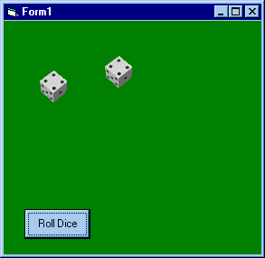



## DiceRoller

### Description

Make dice animation with api, nice and powerfull

i have include the images.Have fun :) Add many dice as you want,animation is done with 3D software.

Please visit my new web site and see what you can do ! VB power !!! come and chat with me http://www.virtualgamer.t2u.com
 
### More Info
 
everything is in the zip file.

             |
---                |---
**Submitted On**   |2000-03-05 23:13:46
**By**             |[HarveySolutions](https://github.com/Planet-Source-Code/PSCIndex/blob/master/ByAuthor/harveysolutions.md)
**Level**          |Intermediate
**User Rating**    |3.4 (17 globes from 5 users)
**Compatibility**  |VB 5\.0, VB 6\.0
**Category**       |[Games](https://github.com/Planet-Source-Code/PSCIndex/blob/master/ByCategory/games__1-38.md)
**World**          |[Visual Basic](https://github.com/Planet-Source-Code/PSCIndex/blob/master/ByWorld/visual-basic.md)
**Archive File**   |[CODE\_UPLOAD3830362000\.zip](https://github.com/Planet-Source-Code/harveysolutions-diceroller__1-6453/archive/master.zip)

